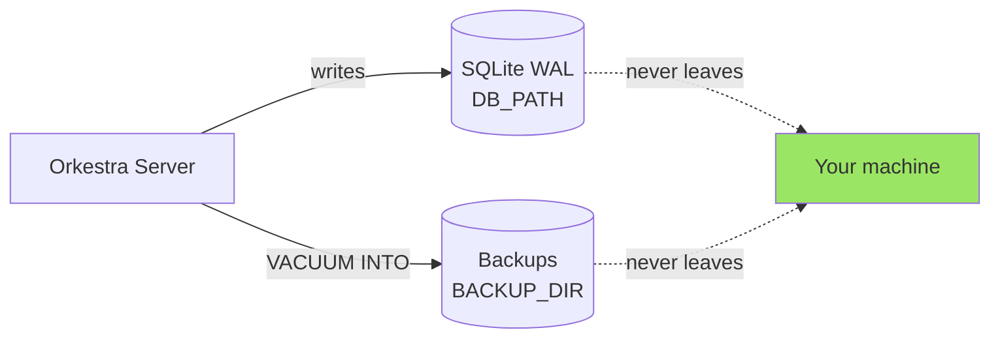
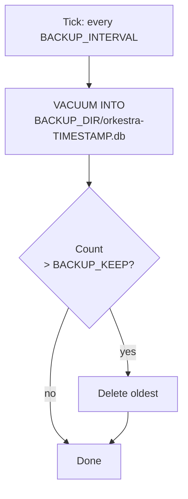

# 🛡️ Data Safety
{: .no_toc }

Your tickets, your disk, your rules.
{: .fs-5 .fw-300 }

<details open markdown="block">
  <summary>Table of contents</summary>
  {: .text-delta }
- TOC
{:toc}
</details>

---

## Where Your Data Lives



No telemetry. No phone-home. No cloud sync. The only network surface is the MCP HTTP listener you point your agents at.

---

## Backups

Orkestra runs a periodic `VACUUM INTO` to a timestamped file in `BACKUP_DIR`, keeping the last `BACKUP_KEEP` snapshots.

| Variable | Default | Purpose |
|----------|---------|---------|
| `BACKUP_DIR` | `/data/backups` | Where snapshots land |
| `BACKUP_KEEP` | `24` | How many to retain (oldest pruned) |
| `BACKUP_INTERVAL` | `1h` | How often to snapshot |



Restore is a file copy: stop the server, replace `DB_PATH` with the snapshot, start again.

---

## Durability

- **WAL mode** — concurrent reads while one writer commits
- **Single writer** — `SetMaxOpenConns(1)` prevents `SQLITE_BUSY` thrash
- **Soft delete** — `archived_at` instead of row deletion; nothing is truly gone unless you `VACUUM`

---

## 🧪 Testing

```bash
go test ./...                # unit + integration
go test -tags e2e ./test/e2e # end-to-end via real HTTP
go test -race ./...          # race detector
```

CI runs all three on every push to every branch — see [`.github/workflows/ci.yml`](https://github.com/Vijay431/Orkestra/blob/main/.github/workflows/ci.yml).

---

## 🐳 Building

```bash
# Local binary
go build -o orkestra ./cmd/server

# Docker (scratch image, ~20 MB)
docker build -t orkestra .
docker compose up -d
```

The image is `FROM scratch` — no shell, no package manager, nothing to exploit beyond the Go binary itself.
