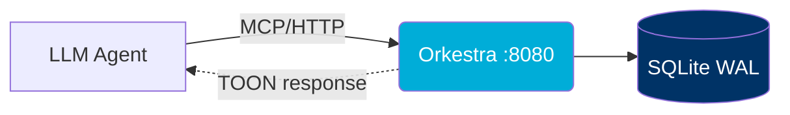
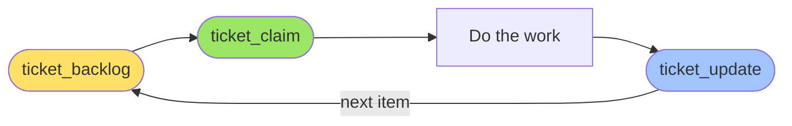

# Orkestra
{: .fs-9 }

A local MCP ticket server your LLM agents can swarm against — no cloud, no rate limits, no per-request billing.
{: .fs-6 .fw-300 }

[Get Started Now]({{ site.baseurl }}/quickstart){: .btn .btn-primary .fs-5 .mb-4 .mb-md-0 .mr-2 }
[View on GitHub](https://github.com/Vijay431/Orkestra){: .btn .fs-5 .mb-4 .mb-md-0 }

---

## Why Orkestra?



| ❌ The Old Way | ✅ Orkestra |
|----------------|-----------|
| Per-request API costs | Local process, $0 forever |
| 400-token JSON ticket blobs | TOON: ~120 tokens (3.3× compression) |
| Rate limits at 50 req/min | Single SQLite writer, ~10k req/sec |
| Cloud dependency | Single 20 MB Docker container |

---

## 🚀 Install in 30 Seconds

```bash
git clone https://github.com/Vijay431/Orkestra
cd Orkestra
PROJECT_ID=myapp ./install.sh
```

Auto-detects and configures **Claude Code · Cursor · Copilot · Windsurf · Zed · Continue.dev**.

---

## 🛠️ 13 Tools, One Loop

Every agent workflow uses the same 3 tools. The other 10 are for power-users.



| Tool | When to use it |
|------|----------------|
| `ticket_backlog` | "What should I work on?" |
| `ticket_claim` | "I'll take this one." (atomic — fails if another agent grabbed it) |
| `ticket_update` | "Done. Moving on." |

→ [Full tool reference]({{ site.baseurl }}/tools/)

---

## 📦 What's TOON?

A custom compact format for LLM context economy. Compare a typical ticket:

```json
// JSON: ~400 tokens
{"id": "myapp-001", "title": "Fix auth bug", "status": "in_progress",
 "priority": "high", "type": "bug", "labels": ["auth", "security"],
 "created_at": "2024-01-15T08:00:00Z", "updated_at": "2024-01-15T10:00:00Z"}
```

```
TOON/1: ~120 tokens
T{id:myapp-001,t:"Fix auth bug",s:ip,p:h,typ:bug,lbl:[auth,security],ca:2024-01-15,ua:2024-01-15T10:00:00Z}
```

→ [TOON reference]({{ site.baseurl }}/toon)

---

## 🧭 Where to Go Next

- **[Quick Start →]({{ site.baseurl }}/quickstart)** Get the server running locally
- **[Tools →]({{ site.baseurl }}/tools/)** Every MCP tool with parameters and examples
- **[Workflows →]({{ site.baseurl }}/workflows)** Common patterns: epics, sequential pipelines, swarming
- **[Architecture →]({{ site.baseurl }}/architecture)** How the pieces fit together
- **[Contributing →]({{ site.baseurl }}/contributing)** Build it with us
