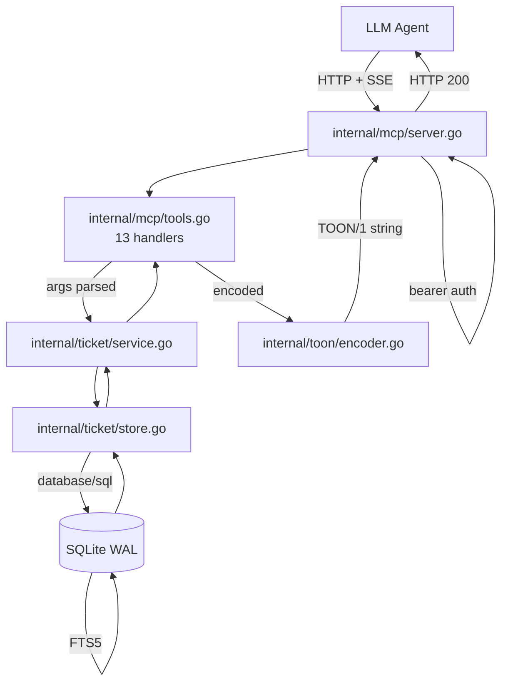

How a request travels from your LLM agent to the SQLite file and back.

## Request path



One round trip. No microservices, no message queues, no external state.

## Package map

| Package | Responsibility | Lines (approx) |
|---------|----------------|----------------|
| `cmd/server/` | Entrypoint, DB init, embedded migrations, graceful shutdown | ~120 |
| `internal/ticket/` | Domain types, SQLite store, service layer, backup loop | ~700 |
| `internal/toon/` | TOON encoder, Mermaid diagram generator | ~500 |
| `internal/mcp/` | MCP server, all 13 tool handlers, bearer auth | ~600 |

The whole thing is under 2,000 lines of Go.

## Key design decisions

### Single-writer SQLite

```go
db.SetMaxOpenConns(1)
```

SQLite's WAL mode handles concurrent reads beautifully but only allows one writer at a time. Capping `MaxOpenConns` to 1 prevents Go from opening multiple write connections that would serialize anyway — and it makes deadlock impossible.

### Etag = updated_at

No separate version column. The RFC3339Nano `updated_at` is precise enough to be a unique etag, and the optimistic-locking SQL is one extra `WHERE` clause:

```sql
UPDATE tickets SET ... WHERE id=? AND updated_at=?
```

If `RowsAffected == 0`, return `ERR{code:conflict}`.

### Soft delete via archived_at

```sql
WHERE archived_at IS NULL
```

Every read query has this. `ticket_archive` just sets `archived_at = NOW()`. No data loss, no `DELETE`, full audit trail.

### Sequential ordering enforcement

```sql
UNIQUE(parent_id, exec_order)
```

Combined with a transaction-level check in `ticket_claim`:

```
SELECT count(*) FROM tickets
WHERE parent_id = ?
  AND exec_order < ?
  AND status != 'dn'
```

If count > 0, the claim fails with `seq_blocked`.

### PROJECT_ID scoping

Every query carries `AND project_id = ?`. Run multiple Orkestra instances on different ports for different projects — they can't see each other's data even if pointed at the same DB file.

## Data safety

```mermaid
flowchart LR
    A[Write] -->|WAL journal| B[(orkestra.db)]
    B -.->|every BACKUP_INTERVAL| C[VACUUM INTO]
    C --> D[/data/backups/orkestra-{timestamp}.db]
    D -->|keep last BACKUP_KEEP| E[old backups deleted]
```

Three layers:

1. **WAL mode** — `PRAGMA journal_mode=WAL` prevents corruption under concurrent reads
2. **Periodic VACUUM INTO** — atomic snapshot, runs every `BACKUP_INTERVAL`
3. **Docker volume** — survives `docker compose down`; only `down -v` destroys it

## Container

The production image is `FROM scratch`:

```
Stage 1 (builder): golang:1.22-alpine
  └─ go build -ldflags="-s -w" -o orkestra ./cmd/server
Stage 2 (final):   FROM scratch
  ├─ /orkestra (binary, ~12 MB stripped)
  ├─ /etc/ssl/certs/ca-certificates.crt
  └─ /ORKESTRA_SKILL.md
```

Total image size: **~20 MB**. No shell, no package manager, no attack surface.
