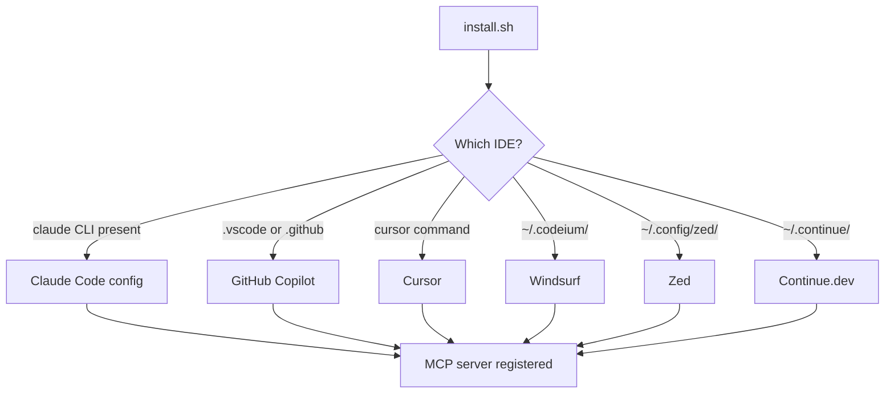

From zero to a running MCP server, talking to your LLM agent, in under a minute.

## The 30-second path

```bash
git clone https://github.com/Vijay431/Orkestra
cd Orkestra
PROJECT_ID=myapp ./install.sh
```

That's it. The installer:

1. Builds the Docker image
2. Starts the server on `:8080`
3. Detects your IDE and adds the MCP server config
4. Verifies the connection with a `/health` ping

## Verify

```bash
curl http://localhost:8080/health
# → {"status":"ok","project":"myapp","db_ok":true,...}
```

If your agent is Claude Code, ask it:

> *"Use ticket_backlog to show me my work queue"*

You should see `TOON/1 [...]` come back — possibly empty if you haven't created any tickets yet.

## What gets auto-configured



The installer is idempotent — re-running it updates the config in place.

## Local development (no Docker)

You only need Go 1.22+:

```bash
PROJECT_ID=dev DB_PATH=/tmp/dev.db go run ./cmd/server
```

The server starts on `:8080` and creates the SQLite file at `/tmp/dev.db`.

## Environment variables

| Variable | Default | What it does |
|----------|---------|--------------|
| `PROJECT_ID` | **(required)** | Ticket prefix and scope filter — every ID becomes `{PROJECT_ID}-NNN` |
| `DB_PATH` | `/data/orkestra.db` | SQLite file location |
| `PORT` | `8080` | HTTP listen port |
| `BIND_ADDR` | `0.0.0.0` | Listen address — set to `127.0.0.1` for localhost-only |
| `MCP_TOKEN` | _(unset)_ | Bearer token for `/sse` and `/message` (optional auth) |
| `LOG_LEVEL` | `info` | `debug` · `info` · `warn` · `error` |
| `BACKUP_DIR` | `/data/backups` | Where periodic backups land |
| `BACKUP_INTERVAL` | `1h` | Go duration string (`30m`, `2h`, `24h`...) |
| `BACKUP_KEEP` | `24` | Backup retention count |

## Inspecting the database

```bash
sqlite3 /tmp/dev.db ".tables"
sqlite3 /tmp/dev.db "SELECT id, title, status, priority FROM tickets WHERE archived_at IS NULL;"
```

Or open it with [DB Browser for SQLite](https://sqlitebrowser.org).

## Next: pick your workflow

- **[Core loop →](./workflows#core-loop)** the 3-tool agent loop
- **[Epics →](./workflows#epic-with-parallel-swarm)** spawn parallel subtask trees
- **[Sequential pipelines →](./workflows#sequential-pipeline)** enforce ordering with `exec_mode=seq`
