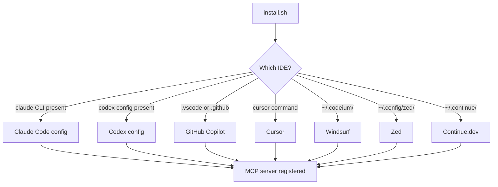

From zero to a running MCP server, talking to your LLM agent, in under a minute.

## Step 1 — Install Orkestra and the agent skill

**Option A (recommended): one-line remote install - no clone required**

```bash
curl -fsSL https://raw.githubusercontent.com/Vijay431/Orkestra/main/install.sh | bash
```

**Option B: clone and install locally**

```bash
git clone https://github.com/Vijay431/Orkestra
cd Orkestra
./install.sh
```

Either path does the same thing:

1. Clones (or updates) the repo to `~/.orkestra` when needed
2. Generates a `PROJECT_ID` like `orkestra-a1b2c3` if you omit one
3. Writes `.env`, builds Docker, starts the server on `:8080`, and waits for health
4. Installs the operator skill to `~/.agents/skills/orkestra/`
5. Detects AI tools and registers MCP as `orkestra-${PROJECT_ID}`

The installer is idempotent - re-running it updates config in place. To pin names, ports, or tools:

```bash
PROJECT_ID=myapp PORT=8080 WEB_PORT=7777 ORKESTRA_TOOLS=codex,claude ./install.sh
curl -fsSL https://raw.githubusercontent.com/Vijay431/Orkestra/main/install.sh | PROJECT_ID=myapp ORKESTRA_TOOLS=all bash
```

### What gets auto-configured



## Step 2 — Run the server

`install.sh` already started a Docker container. If you need to start it yourself:

**Docker:**

```bash
PROJECT_ID=myapp docker compose up -d
```

**Manual / no Docker** (Go 1.26+ required - useful for working on Orkestra itself):

```bash
PROJECT_ID=myapp DB_PATH=/tmp/dev.db go run ./cmd/server
```

## Step 3 — Verify

```bash
curl http://localhost:8080/health
# → {"status":"ok","project":"myapp","db_ok":true,...}
```

Then, in your AI tool, ask: *"Use ticket_backlog to show me my work queue."* You should see `TOON/1 [...]` come back — empty until you create tickets.

## Environment variables

| Variable | Default | What it does |
|----------|---------|--------------|
| `PROJECT_ID` | Generated by installer | Ticket prefix and scope filter - every ID becomes `{PROJECT_ID}-NNN` |
| `DB_PATH` | `/data/orkestra.db` | SQLite file location |
| `PORT` | `8080` | HTTP listen port |
| `WEB_PORT` | `7777` | Host port for the Kanban UI when using Docker Compose |
| `BIND_ADDR` | `0.0.0.0` | Listen address - set to `127.0.0.1` for localhost-only |
| `MCP_TOKEN` | _(unset)_ | Bearer token for `/sse` and `/message` (optional auth) |
| `ORKESTRA_TOOLS` | detected tools | Comma list (`claude,codex,cursor,copilot,windsurf,zed,continue`) or `all` |
| `ORKESTRA_HOME` | `~/.orkestra` | Remote install clone/update location |
| `TARGET_DIR` | current directory | Directory where `.env` and `docker-compose.yml` are written |
| `ORKESTRA_BUILD_CONTEXT` | repo path | Docker build context; written by the installer |
| `LOG_LEVEL` | `info` | `debug` · `info` · `warn` · `error` |
| `BACKUP_DIR` | `/data/backups` | Where periodic backups land |
| `BACKUP_INTERVAL` | `1h` | Go duration string (`30m`, `2h`, `24h`...) |
| `BACKUP_KEEP` | `24` | Backup retention count |

## Inspecting the database

```bash
sqlite3 /tmp/dev.db ".tables"
sqlite3 /tmp/dev.db "SELECT id, title, status, priority FROM tickets WHERE archived_at IS NULL;"
```

Or open it with [DB Browser for SQLite](https://sqlitebrowser.org).

## Next: pick your workflow

- **[Core loop →](./workflows#core-loop)** the 3-tool agent loop
- **[Epics →](./workflows#epic-with-parallel-swarm)** spawn parallel subtask trees
- **[Sequential pipelines →](./workflows#sequential-pipeline)** enforce ordering with `exec_mode=seq`
