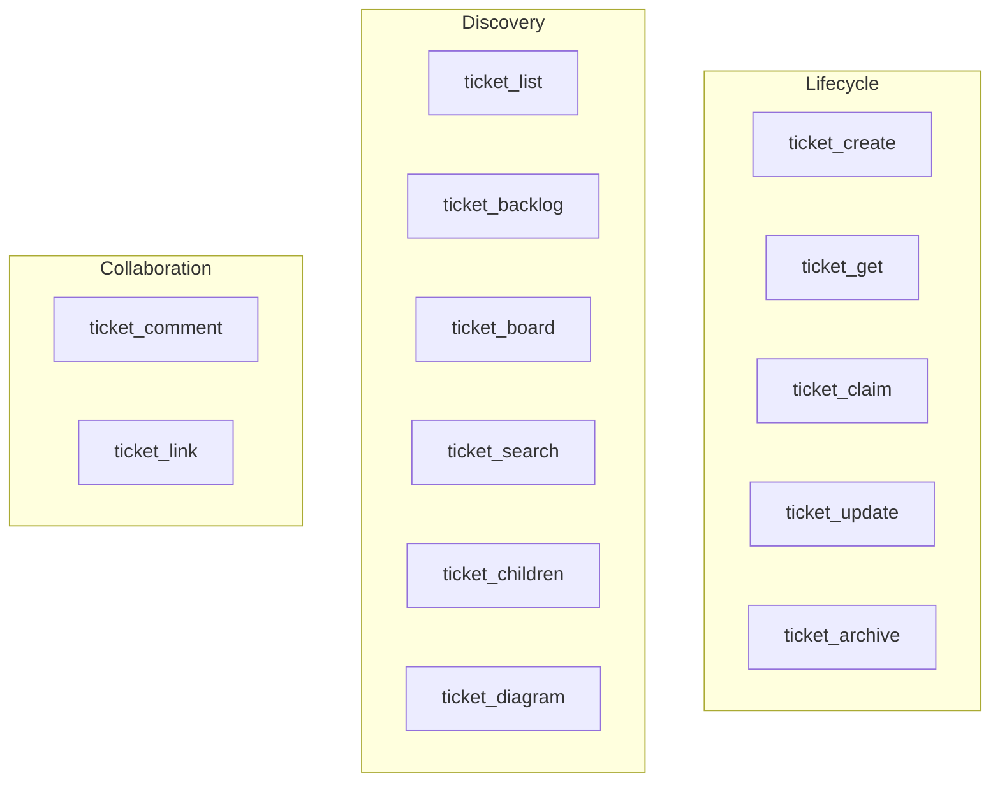

import ToolExplorer from '../../../islands/ToolExplorer.tsx';
import '../../../styles/explorer.css';

Lifecycle, discovery, collaboration. Filter by category, search by keyword, click any card to expand its full schema.

<ToolExplorer client:visible />

## At a glance

## Lifecycle

| Tool | Required | Returns | When |
|------|----------|---------|------|
| `ticket_create` | `title` | `T{...}` | Adding new work |
| `ticket_get` | `id` | `T{...}` (with `cmt`, `lnk`, `ch`) | Reading a single ticket |
| `ticket_claim` | `id` | `T{s:ip,...}` (atomic) | Taking ownership |
| `ticket_update` | `id` | `T{...}` | Changing any field (always send `etag`) |
| `ticket_archive` | `id` | `{ok:true}` | Hiding finished work |

## Discovery

| Tool | Returns | Best for |
|------|---------|----------|
| `ticket_list` | `[T{...}]` | Filtered queries (`status`, `type`, `labels`) |
| `ticket_backlog` | `[T{...}]` priority-ordered | **Start here.** "What should I work on?" |
| `ticket_board` | `BOARD{bk:[],ip:[],...}` | Kanban snapshot |
| `ticket_search` | `[T{...}]` ranked | FTS5 keyword search |
| `ticket_children` | `[T{...}]` | Listing subtasks of a parent |
| `ticket_diagram` | Mermaid flowchart | Visualizing a hierarchy |

## Collaboration

| Tool | Required | Returns |
|------|----------|---------|
| `ticket_comment` | `id`, `body` | `T{...}` (updated ticket) |
| `ticket_link` | `from_id`, `to_id`, `link_type` | `{ok:true}` |

`link_type` is `blk` (blocks), `rel` (relates), or `dup` (duplicates).

## Deeper reference

- **[API Guide](./api-guide)** — every parameter, every default
- **[Examples](./examples)** — annotated end-to-end workflows
- **[Troubleshooting](./troubleshooting)** — error code recovery playbook
