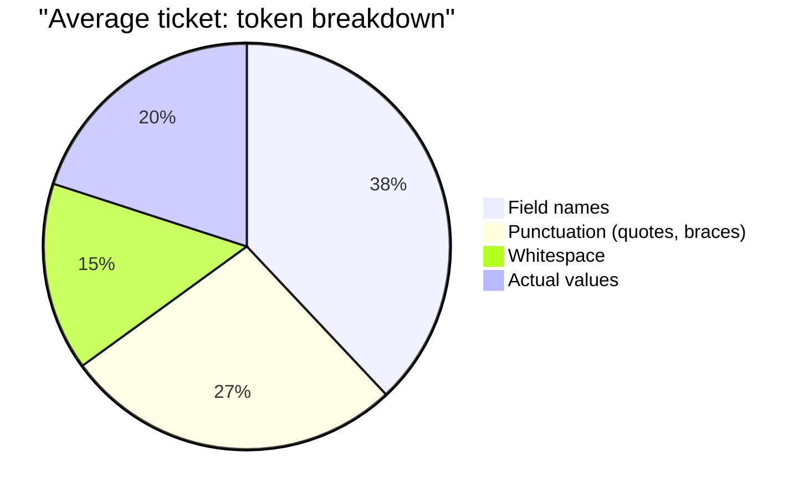

import ToonPlayground from '../../islands/ToonPlayground.tsx';
import LifecycleVisualizer from '../../islands/LifecycleVisualizer.tsx';
import '../../styles/playground.css';
import '../../styles/lifecycle.css';

Tokens-Object-Oriented Notation. A compact typed shorthand designed for LLM context economy.

## Why a new format?

JSON is great for machines. It's expensive for LLMs. Every quote, brace, and verbose field name costs tokens — and tokens cost money and context window.



TOON drops the field names down to 1–3 character aliases, kills the redundant quotes, and uses compact enum codes.

## Try it

<ToonPlayground client:visible />

## At a glance

```
TOON/1 T{id:myapp-001,t:"Fix auth bug",s:ip,p:h,typ:bug,lbl:[auth,sec],ca:2024-01-15,ua:2024-01-15T10:00:00Z}
```

Reading it:

- `TOON/1` — version marker (always present)
- `T{...}` — Ticket envelope
- `id:` `t:` `s:` ... — short field aliases
- `[auth,sec]` — array literal, no quotes around bare strings
- `2024-01-15` — bare ISO date for `ca` (created_at)
- `2024-01-15T10:00:00Z` — RFC3339 timestamp for `ua` (use as etag!)

## Field aliases

| Full | TOON | Full | TOON |
|------|------|------|------|
| `id` | `id` | `exec_mode` | `em` |
| `title` | `t` | `exec_order` | `ord` |
| `status` | `s` | `parent_id` | `par` |
| `priority` | `p` | `children` | `ch` |
| `type` | `typ` | `description` | `d` |
| `labels` | `lbl` | `comments` | `cmt` |
| `assignee` | `as` | `links` | `lnk` |
| `created_at` | `ca` | `updated_at` | `ua` |

## Enum codes

| Domain | Codes |
|--------|-------|
| **Status** | `bk` backlog · `td` todo · `ip` in_progress · `dn` done · `bl` blocked · `cl` cancelled |
| **Priority** | `cr` critical · `h` high · `m` medium · `l` low |
| **Type** | `bug` · `ft` feature · `tsk` task · `ep` epic · `chr` chore |
| **ExecMode** | `par` parallel · `seq` sequential |
| **LinkType** | `blk` blocks · `rel` relates · `dup` duplicates |

## Lifecycle

Click a state to see which tools drive each transition:

<LifecycleVisualizer client:visible />

The two terminal states are `dn` (done) and `cl` (cancelled). Both can be archived (soft-deleted) once you're done with them.

## Envelope types

| Envelope | Shape | Used by |
|----------|-------|---------|
| `T{...}` | Single ticket | `ticket_get`, `ticket_create`, `ticket_claim`, `ticket_update`, `ticket_comment` |
| `[T{...},T{...}]` | Array of tickets | `ticket_list`, `ticket_backlog`, `ticket_search`, `ticket_children` |
| `BOARD{bk:[...],td:[...],ip:[...],...}` | Status-grouped buckets | `ticket_board` |
| `C{a:author,t:"body",ts:timestamp}` | Comment (inside `cmt` array) | `ticket_get` only |
| `L{f:from,t:to,k:blk}` | Link (inside `lnk` array) | `ticket_get` only |
| `{ok:true}` | Success acknowledgment | `ticket_archive`, `ticket_link` |
| `ERR{code:X,msg:"..."}` | Error | All tools (on failure) |

## Error codes

| Code | Cause | Recovery |
|------|-------|----------|
| `not_found` | Ticket doesn't exist or is archived | Verify the ID; try `ticket_search` |
| `conflict` | Etag stale OR ticket already claimed | `ticket_get` → retry with fresh `ua` |
| `seq_blocked` | Sequential predecessor not done | Complete lower `exec_order` sibling first |
| `invalid` | Schema violation (e.g. duplicate `exec_order`) | Check parameters against the [tool reference](./tools/api-guide) |
| `internal` | Server error | Retry once; check `/health` if it persists |
