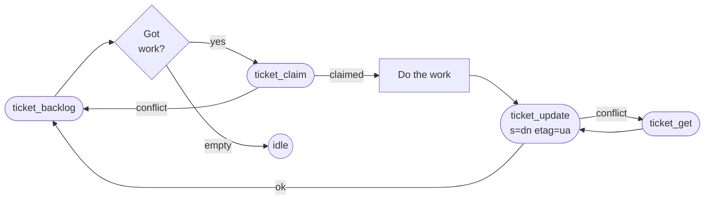
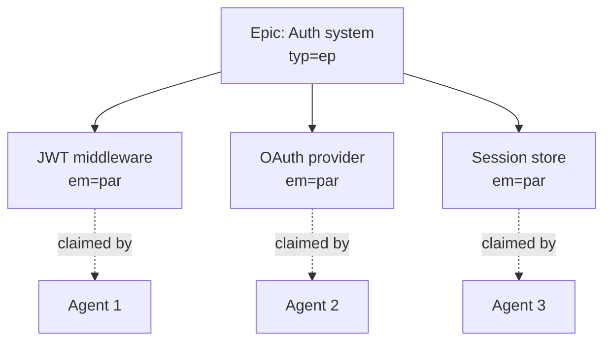
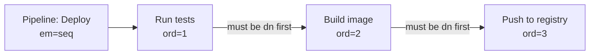
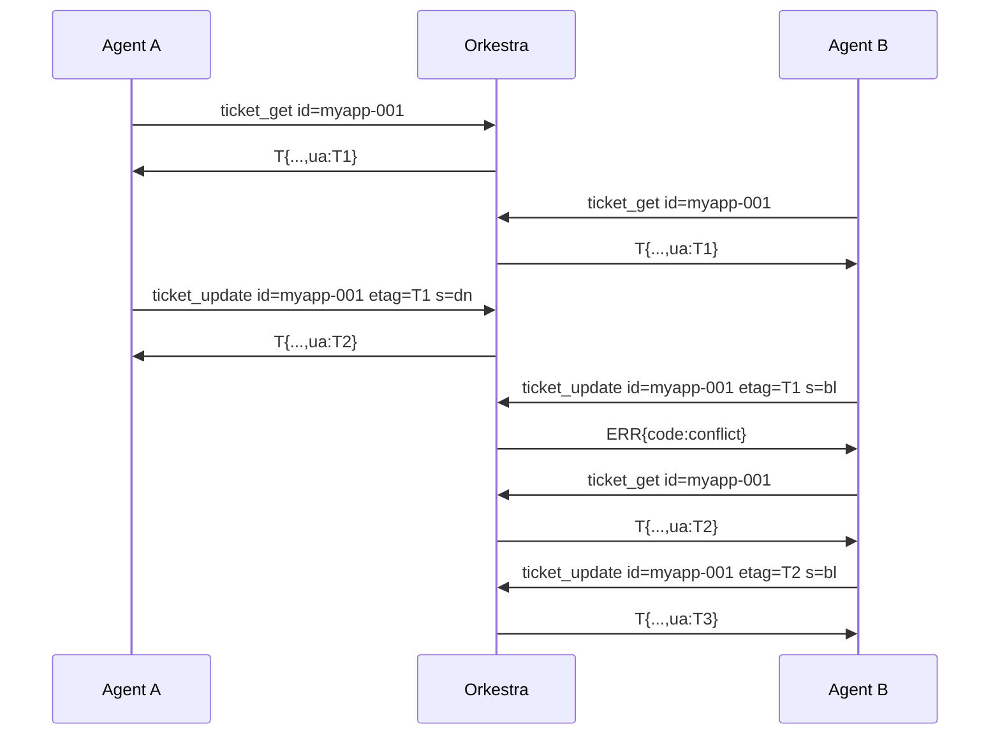

Patterns that work. Steal them.

## Core loop

The shape every agent uses:



Three tools. That's the agent loop. The other 10 are for orchestration.

```
ticket_backlog                          → TOON/1 [T{id:myapp-003,...},...]
ticket_claim id=myapp-003               → T{s:ip,...,ua:2024-01-15T10:05:22Z}
                                        # save ua as etag
(do the work)
ticket_update id=myapp-003 s=dn etag=2024-01-15T10:05:22Z
```

## Epic with parallel swarm

When work decomposes into independent subtasks:



```
ticket_create typ=ep t="Auth system"
ticket_create parent_id=<epic> t="JWT middleware"
ticket_create parent_id=<epic> t="OAuth provider"
ticket_create parent_id=<epic> t="Session store"
```

`exec_mode=par` is the default. All three children land in `bk` and can be claimed concurrently by different agents — `ticket_claim` is atomic, so no two agents grab the same one.

## Sequential pipeline

When order matters:



```
ticket_create typ=tsk t="Deploy pipeline" em=seq
ticket_create parent_id=<pipe> t="Run tests"        em=seq ord=1
ticket_create parent_id=<pipe> t="Build image"      em=seq ord=2
ticket_create parent_id=<pipe> t="Push to registry" em=seq ord=3
```

Now if Agent A tries `ticket_claim id=<ord-2>` before `<ord-1>` is `dn`:

```
→ ERR{code:seq_blocked,msg:"myapp-022 blocked: ord=1 not done"}
```

Agent A then calls `ticket_children` on the pipeline parent, finds `<ord-1>`, and either claims that or backs off.

## Etag optimistic locking

The race condition you don't have to think about:



The etag is just `ua` (updated_at). Always send the freshest one you have. Stale = `ERR{code:conflict}` = re-read, decide, retry.

## Concurrent-agent coordination

Multiple agents on the same backlog don't step on each other:

```
# Agent A                           # Agent B
ticket_backlog                      ticket_backlog
→ [myapp-003, myapp-004, ...]       → [myapp-003, myapp-004, ...]

ticket_claim id=myapp-003           ticket_claim id=myapp-003
→ T{s:ip,...}  ✓                    → ERR{code:conflict}  ← already claimed
                                    ticket_claim id=myapp-004  ← next item
                                    → T{s:ip,...}  ✓
```

The atomic CAS in `ticket_claim` is the whole coordination mechanism. No locks, no leases, no leader election.

## Recipe: when to pick which pattern

| You have... | Use... |
|-------------|--------|
| One task, one agent | Core loop |
| One goal, many independent subtasks | Epic + parallel children (`em=par`) |
| One goal, ordered subtasks | Pipeline + sequential children (`em=seq`) |
| Mix: some parallel, some sequential | Nested parents — outer `em=par`, inner `em=seq` |
| Multiple agents racing to clear a queue | Core loop, all agents call `ticket_backlog` then `ticket_claim` |
